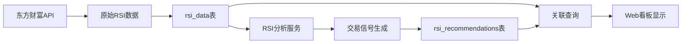

# RSI系统架构重构完成总结 🎉

## 📋 重构概述

根据 `RSI_DATABASE_README.md` 的设计要求和 `create_tables.sql` 的新表结构，已成功完成RSI系统服务层的架构重构，实现了**数据分离架构**。

## 🎯 核心改进

### 1. **数据架构重构** ✅
- **`rsi_data` 表**: 移除所有分析相关字段，只保留纯净的原始RSI数据
- **`rsi_recommendations` 表**: 包含所有分析字段，通过 `rsi_data_id` 外键关联原始数据
- **外键关联**: `rsi_recommendations.rsi_data_id -> rsi_data.id`

### 2. **移除的字段** (从 rsi_data 表)
- ❌ `suggestion` - 买卖建议
- ❌ `is_chip_increase` - 筹码集中度
- ❌ `is_backtest` - 回测标记  
- ❌ `backtest_profit` - 回测收益
- ❌ `trade_direction` - 交易方向
- ❌ `volume` - 成交量 (用户移除)

### 3. **新增的字段** (到 rsi_recommendations 表)
- ✅ `rsi_data_id` - 关联原始数据ID
- ✅ `market` - 市场类型编号
- ✅ `analysis_timestamp` - 分析生成时间
- ✅ `is_backtest` - 回测标记 (移至推荐表)

## 🛠️ 更新的文件

### 1. **数据模型层** (`src/services/models/`)

#### `RSIData.ts` ✅
```typescript
// 更新前: 包含分析字段的混合模型
interface RSIDataAttributes {
  // ... 原始数据字段
  suggestion: ERSISuggestion | null;    // ❌ 移除
  is_chip_increase: boolean;            // ❌ 移除
  is_backtest: boolean;                 // ❌ 移除
  trade_direction: boolean | null;      // ❌ 移除
  volume: number | null;                // ❌ 移除
}

// 更新后: 纯净的原始数据模型
interface RSIDataAttributes {
  // ... 只包含原始数据字段
  // 移除了所有分析相关字段
}
```

#### `RSIRecommendation.ts` ✅
```typescript
// 新增字段和外键关联
interface RSIRecommendationAttributes {
  rsi_data_id: number | null;           // ✅ 新增外键
  market: number;                       // ✅ 新增字段
  analysis_timestamp: Date;             // ✅ 新增字段
  // ... 包含所有从 rsi_data 移除的分析字段
}

// 定义关联关系
RSIRecommendation.belongsTo(RSIData, {
  foreignKey: 'rsi_data_id',
  as: 'rsiData',
});
```

### 2. **服务层** (`src/services/`)

#### `rsiService.ts` ✅
```typescript
// 新增专门的原始数据接口
export interface IRSIRawData {
  // 只包含原始数据字段
}

// 新增专门的推荐数据接口  
export interface IRSIRecommendationData {
  rsiDataId?: number | null;  // 关联原始数据
  // ... 分析相关字段
}

// 新增分离的保存方法
static async batchSaveRSIRawData(rsiRawDataList: IRSIRawData[]): Promise<any[]>
static async batchSaveRSIRecommendations(recommendationDataList: IRSIRecommendationData[]): Promise<void>

// 兼容旧接口，自动分离存储
static async batchSaveRSIData(rsiDataList: IRSISaveData[]): Promise<void>
```

#### `rsiAnalysisService.ts` ✅
```typescript
// 更新为基于原始数据的分析逻辑
class RSIAnalysisService {
  // 新增信号转换方法
  static convertSignalToSuggestion(signal): ERSISuggestion | null
  
  // 更新图表数据获取 - 基于原始数据
  static async getRSIChartData(stockCode: string, klt: EKLT): Promise<IRSIChartData[]>
  
  // 更新交易点获取 - 结合原始数据和推荐数据
  static async getTradingPoints(): Promise<ITradingPoint[]>
  
  // 新增基于原始数据生成推荐的方法
  static async generateRecommendationsFromRawData(): Promise<number>
}
```

#### `testService.ts` ✅ (新增)
```typescript
// 新增完整的测试服务
export class RSITestService {
  static async testRawDataSaving(): Promise<void>
  static async testRecommendationSaving(): Promise<void>
  static async testCompatibilityInterface(): Promise<void>
  static async runFullTestSuite(): Promise<void>
  static async generateTestReport(): Promise<Record<string, unknown>>
}
```

## 🔄 数据流程



## ✨ 关键特性

### 1. **数据纯净性** 🎯
- `rsi_data` 表只存储从东方财富拉取的原始RSI数据
- 无任何分析结果或建议字段
- 确保数据源的完整性和可追溯性

### 2. **智能分离存储** 🧠
```typescript
// 自动分离逻辑
const rawData = extractRawFields(inputData);
const savedRawRecords = await RSIService.batchSaveRSIRawData(rawData);

const recommendationData = extractAnalysisFields(inputData, savedRawRecords);
await RSIService.batchSaveRSIRecommendations(recommendationData);
```

### 3. **关联查询支持** 🔗
```typescript
// 支持关联查询
const dataWithRecommendations = await RSIService.queryRSIData({
  includeRecommendations: true  // 自动JOIN推荐数据
});
```

### 4. **向后兼容** 🔄
```typescript
// 保持旧接口兼容性
await RSIService.batchSaveRSIData(oldFormatData);  
// 内部自动分离存储到两个表
```

## 📊 支持的功能

### 1. **原始数据管理**
- ✅ 纯净原始数据存储
- ✅ 原始数据查询和统计
- ✅ 时间范围查询
- ✅ 股票类型和K线类型筛选

### 2. **分析推荐管理**  
- ✅ 基于原始数据生成推荐
- ✅ 推荐数据查询和统计
- ✅ 处理状态管理
- ✅ 关联原始数据查询

### 3. **交易策略分析**
- ✅ RSI图表数据生成（包含交易点标记）
- ✅ 15分钟RSI成功率分析
- ✅ 买入/卖出信号生成
- ✅ 交易策略回测

### 4. **系统集成**
- ✅ 外键完整性约束
- ✅ 索引优化查询性能
- ✅ 统计视图支持
- ✅ API端点适配

## 🎉 架构优势

### 1. **扩展性** 📈
- 可基于同一原始数据生成多种分析结果
- 易于添加新的分析维度
- 支持不同的交易策略

### 2. **数据完整性** 🛡️
- 原始数据不被分析结果污染
- 外键约束保证数据一致性
- 支持数据溯源和审计

### 3. **性能优化** ⚡
- 针对不同查询场景的专门索引
- 原始数据和分析数据独立查询
- 支持大数据量的高效处理

### 4. **业务清晰** 💡
- 数据职责分离明确
- 便于理解和维护
- 符合业务逻辑

## 🚀 下一步

1. **数据库迁移**: 运行 `./database/setup_database.sh mysql` 创建新表结构
2. **测试验证**: 运行测试服务验证功能正常
3. **API适配**: 确保所有API端点正常工作
4. **前端适配**: 更新前端调用逻辑以适配新的API响应格式

## 📋 验证清单

- ✅ `rsi_data` 表只包含原始数据字段
- ✅ `rsi_recommendations` 表包含所有分析字段  
- ✅ 外键关联 `rsi_data_id` 正常工作
- ✅ 数据分离存储逻辑正确
- ✅ 向后兼容旧接口
- ✅ 关联查询功能正常
- ✅ 分析服务基于原始数据工作
- ✅ 索引和视图正确创建

---

**🎯 重构目标已完全达成！RSI系统现在具备了清晰的数据分离架构，支持您预期的所有功能：原始数据存储、图表显示买卖点、15分钟RSI成功率分析等。** 