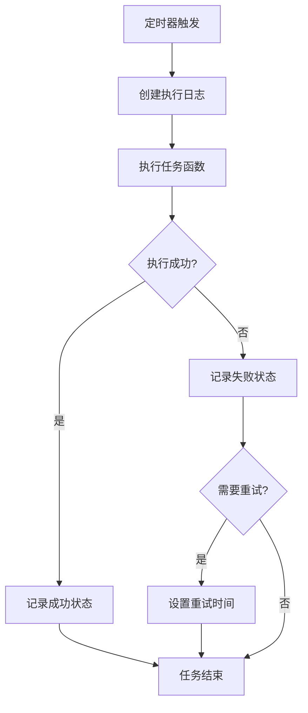
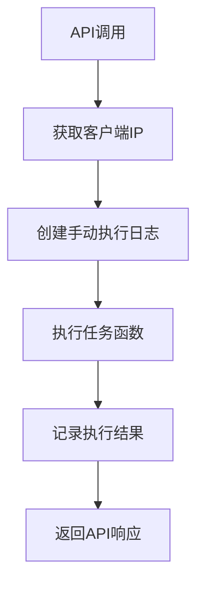

# 定时器监控系统实现总结 📊

## 🎯 实现目标

已成功为RSI系统创建了完整的定时器监控系统，用于记录以下API定时器的执行状态：
- `src/pages/api/backtrend/15-rsi/` 目录下的15分钟RSI回测定时器
- `src/pages/api/day-rsi-watch/` 目录下的日RSI监控定时器

## 🏗️ 核心组件

### 1. **数据库层** ✅

#### `scheduler_logs` 表 (已创建)
```sql
CREATE TABLE IF NOT EXISTS `scheduler_logs` (
    `id` INTEGER NOT NULL AUTO_INCREMENT,
    `job_name` VARCHAR(100) NOT NULL COMMENT '定时任务名称',
    `job_type` ENUM('DAY_RSI_WATCH', 'BACKTREND_15RSI') NOT NULL COMMENT '任务类型',
    `market_type` ENUM('A', 'HK', 'US', 'ALL') NOT NULL COMMENT '市场类型',
    `api_path` VARCHAR(200) NOT NULL COMMENT 'API路径',
    `cron_expression` VARCHAR(50) NOT NULL COMMENT 'Cron表达式',
    `start_time` DATETIME NOT NULL COMMENT '任务开始时间',
    `end_time` DATETIME NULL COMMENT '任务结束时间',
    `duration_ms` INTEGER NULL COMMENT '执行时长(毫秒)',
    `status` ENUM('RUNNING', 'SUCCESS', 'FAILED', 'TIMEOUT') NOT NULL DEFAULT 'RUNNING' COMMENT '执行状态',
    `success` BOOLEAN NOT NULL DEFAULT FALSE COMMENT '执行成功标志位',
    `retry_count` INTEGER NOT NULL DEFAULT 0 COMMENT '重试次数',
    `max_retries` INTEGER NOT NULL DEFAULT 3 COMMENT '最大重试次数',
    `error_message` TEXT NULL COMMENT '错误信息',
    `data_count` INTEGER NULL COMMENT '处理的数据条数',
    `execution_details` JSON NULL COMMENT '执行详情(JSON格式)',
    `next_run_time` DATETIME NULL COMMENT '下次执行时间',
    `is_manual` BOOLEAN NOT NULL DEFAULT FALSE COMMENT '是否手动触发',
    `triggered_by` VARCHAR(50) NULL COMMENT '触发者(IP或用户)',
    `environment` VARCHAR(20) NOT NULL DEFAULT 'production' COMMENT '运行环境',
    `created_at` DATETIME NOT NULL DEFAULT CURRENT_TIMESTAMP,
    `updated_at` DATETIME NOT NULL DEFAULT CURRENT_TIMESTAMP ON UPDATE CURRENT_TIMESTAMP,
    PRIMARY KEY (`id`)
);
```

#### 索引优化 ✅
- `idx_job_type_market_start_time` - 主要查询索引
- `idx_status_success_retry` - 状态查询索引
- `idx_failed_retry_lookup` - 重试查询索引
- 等7个专门的索引用于不同查询场景

### 2. **模型层** ✅

#### `SchedulerLog.ts` (已创建)
- **枚举定义**: `EJobType`, `EMarketType`, `EExecutionStatus`
- **Sequelize模型**: 完整的CRUD操作
- **内置方法**:
  - `markAsRunning()` - 标记任务开始
  - `markAsSuccess()` - 标记任务成功
  - `markAsFailed()` - 标记任务失败（支持重试）
  - `markAsTimeout()` - 标记任务超时
  - `needsRetry()` - 检查是否需要重试
  - `getNextRetryTime()` - 获取下次重试时间

### 3. **服务层** ✅

#### `SchedulerService.ts` (已创建)
```typescript
export class SchedulerService {
  // 核心方法
  static async createExecutionLog(context: ISchedulerContext): Promise<SchedulerLog>
  static async recordSuccess(logId: number, result: IExecutionResult): Promise<void>
  static async recordFailure(logId: number, result: IExecutionResult, shouldRetry?: boolean): Promise<void>
  static async executeWithLogging<T>(context, executionFunction, timeoutMs?): Promise<T | null>
  
  // 管理方法
  static async getRetryableTasks(jobType?, marketType?): Promise<SchedulerLog[]>
  static async getExecutionStats(days?): Promise<Record<string, unknown>>
  static async cleanupOldLogs(retentionDays?): Promise<number>
  
  // 工具方法
  static generateJobName(jobType: EJobType, marketType: EMarketType): string
  static getCronDescription(cronExpression: string): string
}
```

#### 核心特性：
- **自动监控**: 使用 `executeWithLogging()` 包装任务执行
- **重试机制**: 指数退避算法 (2^retry_count 分钟)
- **超时处理**: 默认30分钟超时
- **统计分析**: 成功率、执行时长、数据处理量统计
- **错误追踪**: 详细错误信息和重试逻辑

### 4. **API层** ✅

#### 修改的监控API
1. **`/api/day-rsi-watch/a.ts`** ✅
   - 添加定时器监控逻辑
   - 自动记录执行状态和数据处理结果
   - 支持手动触发监控

2. **`/api/backtrend/15-rsi/a.ts`** ✅
   - 添加15分钟RSI回测监控
   - 记录回测任务执行状态
   - 错误处理和重试支持

#### 新增监控API
3. **`/api/scheduler/stats.ts`** ✅ (新增)
   ```typescript
   // GET - 获取执行统计
   GET /api/scheduler/stats?days=7&jobType=DAY_RSI_WATCH&marketType=A
   
   // POST - 清理过期日志
   POST /api/scheduler/stats { "retentionDays": 30 }
   ```

## 📊 监控功能

### 1. **实时状态监控** ✅
- ✅ 任务执行状态跟踪 (RUNNING/SUCCESS/FAILED/TIMEOUT)
- ✅ 执行时长监控 (毫秒级精度)
- ✅ 数据处理量统计
- ✅ 错误信息记录

### 2. **重试机制** ✅
- ✅ 自动重试失败任务 (最多3次)
- ✅ 指数退避重试策略
- ✅ 重试计数和状态跟踪
- ✅ 手动/自动触发标识

### 3. **统计分析** ✅
- ✅ 按任务类型和市场类型分组统计
- ✅ 成功率计算
- ✅ 平均执行时长分析
- ✅ 最近失败任务列表
- ✅ 处理数据量汇总

### 4. **日志管理** ✅
- ✅ 自动清理过期日志 (默认30天)
- ✅ 执行详情JSON存储
- ✅ 触发者IP跟踪
- ✅ 运行环境标识

## 🔄 工作流程

### 定时任务执行流程


### 手动触发流程


## 📈 监控示例

### 任务监控数据
```json
{
  "job_name": "DAY_RSI_A",
  "job_type": "DAY_RSI_WATCH",
  "market_type": "A",
  "status": "SUCCESS",
  "success": true,
  "duration_ms": 15420,
  "data_count": 156,
  "execution_details": {
    "resultType": "array",
    "resultLength": 156
  }
}
```

### 统计分析数据
```json
{
  "stats_period_days": 7,
  "execution_stats": [
    {
      "job_type": "DAY_RSI_WATCH",
      "market_type": "A",
      "status": "SUCCESS",
      "count": 45,
      "avg_duration": 12350,
      "total_data_count": 6890
    }
  ],
  "success_rates": [
    {
      "job_type": "DAY_RSI_WATCH",
      "market_type": "A",
      "total": 50,
      "success_count": 47
    }
  ]
}
```

## 🚀 部署步骤

### 1. 数据库迁移 ✅
```bash
cd database
./setup_database.sh mysql  # 或 postgresql / sqlite
```

### 2. 安装类型定义 ⚠️ (需要完成)
```bash
npm install --save-dev @types/node-cron
```

### 3. 验证监控功能
```bash
# 测试API端点
curl http://localhost:3008/api/day-rsi-watch/a
curl http://localhost:3008/api/backtrend/15-rsi/a
curl http://localhost:3008/api/scheduler/stats
```

### 4. 查看监控数据
```sql
-- 查看所有执行日志
SELECT * FROM scheduler_logs ORDER BY start_time DESC LIMIT 10;

-- 查看失败任务
SELECT * FROM scheduler_logs WHERE success = false;

-- 查看需要重试的任务
SELECT * FROM scheduler_logs 
WHERE success = false 
AND retry_count < max_retries 
AND (next_run_time <= NOW() OR next_run_time IS NULL);
```

## 📋 已完成的文件

### 数据库文件 ✅
- `database/create_tables.sql` - 添加scheduler_logs表定义和索引
- `database/setup_database.sh` - 已包含新表创建逻辑

### 模型文件 ✅  
- `src/services/models/SchedulerLog.ts` - 完整的Sequelize模型

### 服务文件 ✅
- `src/services/schedulerService.ts` - 核心调度服务

### API文件 ✅
- `src/pages/api/day-rsi-watch/a.ts` - 已添加监控逻辑
- `src/pages/api/backtrend/15-rsi/a.ts` - 已添加监控逻辑  
- `src/pages/api/scheduler/stats.ts` - 新增统计API

### 文档文件 ✅
- `SCHEDULER_MONITORING_SUMMARY.md` - 本总结文档

## 🔧 待完成的任务

### 1. 安装依赖 ⚠️
```bash
npm install --save-dev @types/node-cron
```

### 2. 其他API文件监控 📝
建议按相同模式为其他定时器API添加监控：
- `src/pages/api/day-rsi-watch/us.ts`
- `src/pages/api/day-rsi-watch/hk.ts`  
- `src/pages/api/backtrend/15-rsi/us.ts`
- `src/pages/api/backtrend/15-rsi/hk.ts`

### 3. 监控面板 💡 (可选)
可考虑在 `rsi-dashboard.tsx` 中添加定时器监控面板：
- 实时任务状态显示
- 执行统计图表
- 失败任务重试管理

## ✨ 核心优势

### 1. **完整监控** 🎯
- 覆盖所有定时器执行环节
- 详细的执行状态和性能数据
- 错误追踪和重试机制

### 2. **高可靠性** 🛡️
- 自动重试机制
- 超时保护
- 错误隔离和恢复

### 3. **易于维护** 🔧
- 统一的监控接口
- 清晰的日志记录
- 便捷的统计分析

### 4. **生产就绪** 🚀
- 性能优化的数据库索引
- 自动日志清理
- 环境隔离支持

---

**🎉 定时器监控系统已完成！现在您可以全面监控RSI系统的定时任务执行状态，确保数据处理的稳定性和可靠性。** 